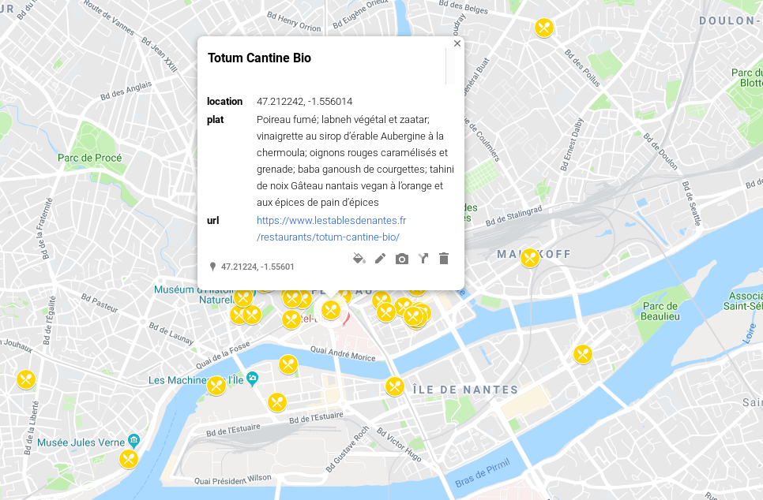

# Simple NODEJS script to create a csv map of Les Tables de Nantes Events

Un script simple qui scrap le site des Tables de Nantes pour créer un csv contenant la localisation des restos, leur nom, la liste de leur plat et l'adresse du site.

- [Basé sur la carte proposé par le site](./map.xml)

[Fichier csv](./result.csv) généré avec le script

